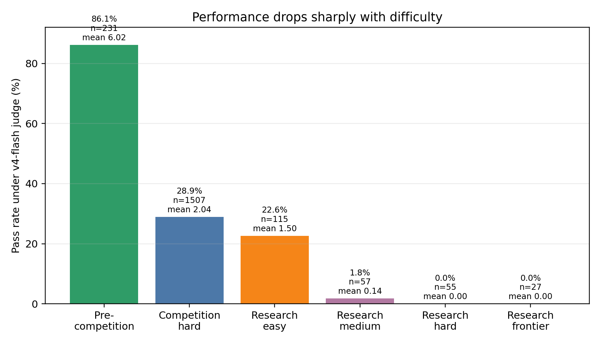
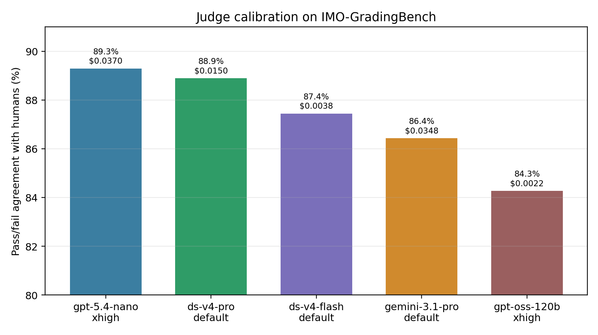
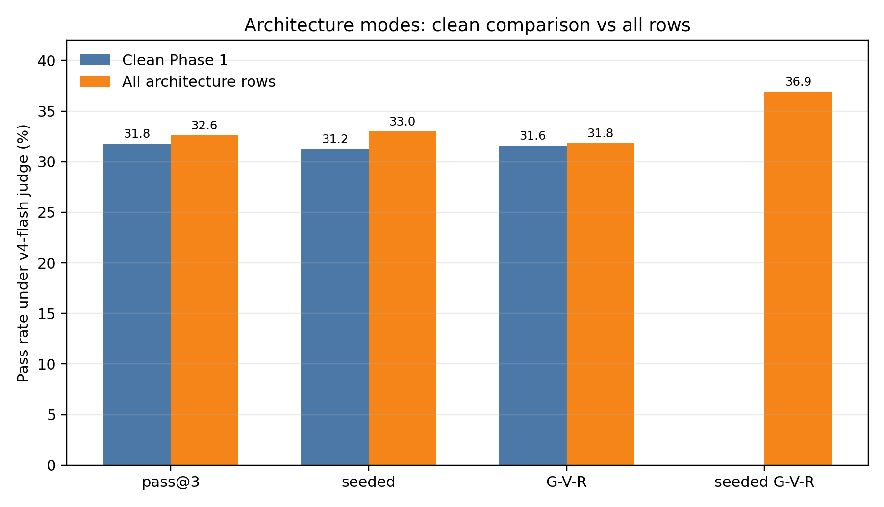
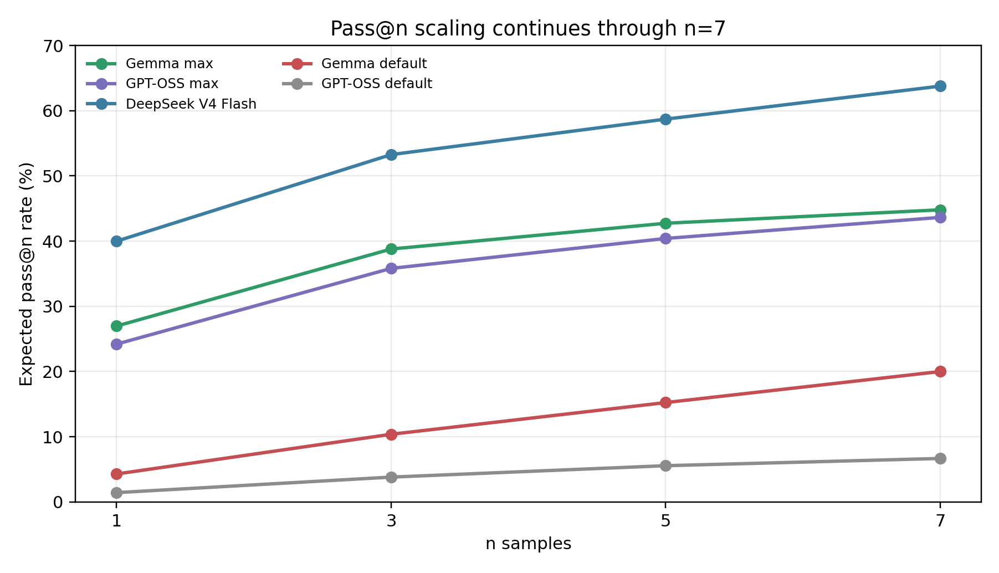

# Sampling Is a Strong Baseline for Natural-Language Mathematical Proof Generation

## Abstract

We evaluate lightweight inference-time methods for natural-language mathematical proof generation on a 70-problem benchmark: 60 IMO-ProofBench problems plus 10 recent research-facing problems from Erdős problem resolutions, First Proof, and FrontierMath Open Problems. We compare pass@k generation, seeded ideation, generator-verifier-reviser loops, and seeded generator-verifier-reviser loops across several API models. Because long proof grading is itself difficult, we first calibrate model judges on IMO-GradingBench and short-answer solvers on AnswerBench.

The main result is that simple sampling is a stronger baseline than the agentic scaffolding suggests. In the clean six-model Phase 1 sweep, pass@3 generation, seeded generation, and generator-verifier-reviser pipelines all land near 31-32% pass rate under the canonical calibrated judge. The richer pipelines do not reliably beat pass@3. The largest effects are judge choice, reasoning effort, and pass@k scaling. DeepSeek V4 Flash gives 87.4% pass/fail agreement with human labels on a 200-item GradingBench sample at $0.0039 per call, so we use it as the canonical judge. With that judge, DeepSeek V4 Flash generation on the full 70-problem set rises from 40% pass rate at n=1 to 64% at n=7. Research-grade pass judgments occur, but they are concentrated in easier frontier items and should be treated as candidates for expert review, not claims of new mathematics.

## 1. Introduction

Mathematical reasoning benchmarks have moved quickly. Formal systems such as AlphaProof reached silver-level IMO performance in 2024 [1]. Gemini Deep Think later reported official gold-medal standard performance on IMO 2025 in natural language [2], while systems such as Aristotle push toward formal verification [3]. Code-evolution systems such as AlphaEvolve occupy another regime when automatic evaluators exist [12]. At the research frontier, AI-assisted work has appeared in Erdős problems, First Proof, and FrontierMath-style open problems [4,5,6,7].

This creates a practical evaluation question. Suppose a researcher can call strong language models but cannot run a full formal theorem prover or human grading panel for every attempt. Should they sample more direct proofs, ask for ideas first, run verifier-reviser loops, mix models across roles, or combine these steps?

The richer procedures sound more like mathematical work. They also cost more. A pipeline that spends three or nine calls should not be compared to pass@1. It should be compared to spending the same budget on direct samples. Repeated sampling and self-consistency have long been strong baselines in code and reasoning tasks [8,9]. Verifier-reviser loops and prompted refinement are also central in recent math-agent reports [4,13], while seeded ideation is visible in public First Proof notes [14]. This paper asks whether lightweight proof scaffolds beat the sampling baseline.

Our answer is mostly no. In the clean comparison, seeded ideation and generator-verifier-reviser loops are flat against pass@3. The robust gains come from enabling reasoning effort, sampling more attempts, and using a calibrated judge.

## 2. Benchmark and Setting

We evaluate 70 problems. The base is IMO-ProofBench: 30 basic and 30 advanced proof problems from IMO-Bench [10,11]. We add 10 recent Research-2026 problems:

| Source | Problems |
|---|---|
| Erdős | 333, 397, 654, 659, 1051 |
| First Proof | 4, 5, 6, 10 |
| FrontierMath Open Problems | Ramsey hypergraphs |

These are not presented as unsolved by us. They are used because public or expert-accepted solution context exists and because they form a harder tail than ProofBench alone. First Proof was designed around unpublished research-level questions with temporarily hidden answers [5]. Epoch's Ramsey hypergraphs problem is a FrontierMath Open Problem whose solution was first elicited by GPT-5.4 Pro and confirmed by the problem contributor [6]. The Erdős items come from the recent public record of AI contributions to Erdős problems, a record that is explicitly provisional and not a clean benchmark [7].

For analysis we use two labels. `Research-2026` means membership in the 10 added problems. `difficulty` is a six-level scale: pre-competition, competition-hard, research-easy, research-medium, research-hard, and research-frontier. These are related but not identical: Erdős 397 is in Research-2026 but is tagged competition-hard.

Performance drops sharply with difficulty:

Under the canonical judge, pre-competition items pass 86.1% of the time. Competition-hard items pass 28.9%. Research-easy items pass 22.6%. Research-medium items pass 1.8%, and research-hard/frontier items receive no passes in the main architecture bucket. Any aggregate result over all 70 problems should therefore be read together with this difficulty gradient.

## 3. Methods

We test four inference-time modes.

| Mode | Description |
|---|---|
| `generate` | Direct pass@3 generation; the trial score is the best judged branch. |
| `seed_generate` | Ask for ideas, then generate proofs from those ideas. |
| `full` | Generator-verifier-reviser loop. |
| `seed_full` | Seeded ideation plus generator-verifier-reviser loop. |

The cleanest architecture comparison is Phase 1: six models, 70 problems, and three modes (`generate`, `seed_generate`, `full`). `seed_full` was collected in later runs and has asymmetric coverage, so we treat it as suggestive rather than a clean fourth arm.

All proof scores are on a 0-7 scale. A pass is score >= 6. For scaling experiments, pass@n is computed by exhaustive subset enumeration: for each problem, every size-n subset of available branches is scored by the maximum branch score in that subset, then averaged.

The study uses five result buckets: AnswerBench calibration, GradingBench calibration, architecture, scaling, and roleswap. Headline aggregates were checked against the CSVs in `results/`, not copied only from summary reports. Figures are generated by `codex_draft_and_work/plots/make_plots.py`.

## 4. Judge Calibration

Automated proof grading is the main methodological risk. A judge can be lenient, conservative, or overly sensitive to style. We therefore calibrate candidate judges on a 200-item sample from IMO-GradingBench, using the same pass threshold as the main experiments. The grading prompt restricts outputs to 0, 1, 6, or 7, so we emphasize pass/fail agreement over fine-grained exact match.

| Judge | n | Pass agreement | Recall | Precision | F1 | Pearson r | Mean delta | Cost/call |
|---|---:|---:|---:|---:|---:|---:|---:|---:|
| GPT-5.4-nano xhigh | 196 | 89.3% | 70.0% | 93.3% | 0.800 | 0.712 | -0.95 | $0.0370 |
| DeepSeek V4 Pro | 198 | 88.9% | 82.5% | 82.5% | 0.825 | 0.756 | -0.75 | $0.0150 |
| DeepSeek V4 Flash | 199 | 87.4% | 79.4% | 80.6% | 0.800 | 0.756 | -0.80 | $0.0039 |
| Gemini 3.1 Pro | 199 | 86.4% | 95.2% | 71.4% | 0.816 | 0.872 | +0.13 | $0.0348 |
| GPT-OSS 120B xhigh | 178 | 84.3% | 89.7% | 70.3% | 0.788 | 0.770 | +0.21 | $0.0022 |

Different judges are best for different purposes. GPT-5.4-nano has the highest pass agreement but is conservative. DeepSeek V4 Pro has the best F1 at the pass threshold. Gemini 3.1 Pro is the best continuous calibrator, with Pearson r = 0.872 and low mean bias, but it is more lenient at the pass threshold. DeepSeek V4 Flash is close to the top pass/fail judges and much cheaper, so we use it as the canonical judge.

This choice changes the headline. Lenient judges tended to grade pipeline outputs more favorably. A proof-generation paper should therefore report judge calibration as part of the main result, not as a peripheral implementation detail.

## 5. Solver Calibration and Reasoning Effort

AnswerBench-50 gives a short-answer capability check. It is not a proof benchmark, but it identifies strong models and exposes reasoning-effort confounds. The Gemini 3 Flash xhigh row below is a synthesized effective row from a targeted retest, not a full independent 50-problem rerun.

| Model/config | Accuracy | Cost/run | Mean generation latency |
|---|---:|---:|---:|
| DeepSeek V4 Pro default | 47/50 | $0.0185 | 723s |
| GPT-5.4-nano xhigh | 45/49 | $0.0560 | 1,243s |
| Gemini 3 Flash xhigh effective | 45/50 | $0.0337 | 51s |
| DeepSeek V4 Flash default | 44/50 | $0.0055 | 357s |
| Qwen3.6 35B A3B default | 40/50 | $0.0218 | 139s |
| GPT-OSS 120B xhigh | 37/50 | $0.0057 | 565s |
| Gemma 4 31B default | 34/50 | $0.0015 | 235s |

Reasoning effort is a first-order variable. GPT-OSS improves from 29/50 to 37/50 when moved from default to xhigh. DeepSeek V4 Flash drops from 44/50 to 25/50 when reasoning is explicitly disabled. On GradingBench, GPT-OSS pass agreement rises from 71.9% to 84.3% with xhigh reasoning, and Gemma rises from 65.5% to 79.0% with high reasoning. These gains are larger than the clean architecture deltas below.

## 6. Main Architecture Results

The clean Phase 1 result is almost flat:

| Phase 1 mode | Valid n | Mean score | Pass rate |
|---|---:|---:|---:|
| pass@3 generate | 406 | 2.23 | 31.8% |
| seeded generate | 416 | 2.18 | 31.2% |
| generator-verifier-reviser | 412 | 2.22 | 31.6% |

This is the core result. On the same models and problems, neither seeded ideation nor the generator-verifier-reviser loop beats direct pass@3. The differences are too small to interpret as a reliable ordering.

Individual model cells vary. DeepSeek V4 Pro does best in the full loop, at 3.85 mean score and 54.5% pass rate. DeepSeek V4 Flash does slightly best in seeded generation, at 3.41 and 49.3%. Qwen is roughly tied between direct and seeded generation. Gemini 3 Flash and Gemma regress under richer prompts. GPT-OSS has a low baseline and small differences. This heterogeneity is exactly why the aggregate claim should be conservative.

Across all architecture rows, `seed_full` has the best mean score and pass rate:

| All architecture rows | Valid n | Mean score | Pass rate |
|---|---:|---:|---:|
| generate | 543 | 2.31 | 32.6% |
| seeded generate | 555 | 2.29 | 33.0% |
| full | 550 | 2.24 | 31.8% |
| seed_full | 344 | 2.58 | 36.9% |

But `seed_full` was not run in the clean Phase 1 grid. Its rows come from later experiments and reasoning reruns. The best small-model cell is Gemma 4 31B with max reasoning and seed_full: mean 3.31, pass rate 47.1%, and three Research-2026 pass judgments. This is a useful lead, but it combines mode, coverage, and reasoning effort. It does not overturn the clean Phase 1 result.

## 7. Scaling Results

Pass@k is the strongest baseline. In the generate rows, the first branch gives a correlated pass@1 proxy. Moving to pass@3 increases Phase 1 mean score by 0.40 and pass rate by 5.5 points. In the reasoning rerun, pass@3 increases mean score by 0.56 and pass rate by 6.5 points.

The dedicated scaling runs show continued gains through n=7:

| Model | Reasoning | Problems | n=1 mean/pass | n=3 mean/pass | n=7 mean/pass |
|---|---|---:|---:|---:|---:|
| Gemma 4 31B | default | 30 | 0.31 / 4.3% | 0.74 / 10.4% | 1.40 / 20.0% |
| GPT-OSS 120B | default | 30 | 0.10 / 1.4% | 0.27 / 3.8% | 0.47 / 6.7% |
| Gemma 4 31B | max | 70 | 1.92 / 27.0% | 2.76 / 38.8% | 3.20 / 44.8% |
| GPT-OSS 120B | max | 70 | 1.68 / 24.2% | 2.49 / 35.8% | 3.08 / 43.6% |
| DeepSeek V4 Flash | default | 70 | 2.81 / 40.0% | 3.78 / 53.3% | 4.54 / 63.8% |

For DeepSeek V4 Flash, n=1 to n=7 adds 1.72 mean score points and 23.8 pass-rate points. For max-reasoning GPT-OSS, it adds 1.40 points and 19.4 pass-rate points. For max-reasoning Gemma, it adds 1.28 points and 17.8 pass-rate points. These gains dominate the clean architecture differences.

The implication is not that pass@k is the final architecture. It is that every proposed scaffold should beat the pass@k curve at the same cost.

## 8. Model Diversity and Role Swaps

The role-swap experiments test whether mixing models across ideator, generator, verifier, and reviser roles helps. The main grid uses Gemma 4 31B and GPT-OSS 120B under default and max reasoning.

The average of the two random baselines is 1.78 mean score and 25.7% pass rate at default reasoning, and 3.27 mean score and 46.7% pass rate at max reasoning. The best single-role condition is using GPT-OSS as verifier:

| Setting | Random baseline | Best role-swap condition | Lift |
|---|---:|---:|---:|
| Default reasoning | 1.78 / 25.7% | 2.07 / 29.0% | +0.29 / +3.3 pp |
| Max reasoning | 3.27 / 46.7% | 3.63 / 51.4% | +0.36 / +4.7 pp |

This is suggestive but small. It is also less stable than reasoning and scaling. Naive model diversity may help in verifier-like roles, but it is not a substitute for more samples or stronger reasoning.

## 9. Research-Grade Results

Research-2026 is the most interesting section and the easiest to overstate. We therefore separate judged pass events from mathematical claims.

Across architecture and roleswap rows, the canonical judge finds 46 passes among 439 valid Research-2026 attempts. They are concentrated:

| Problem | Pass judgments |
|---|---:|
| First Proof 10 | 32 |
| Erdős 654 | 8 |
| Erdős 333 | 3 |
| Erdős 397 | 1 |
| Erdős 659 | 1 |
| First Proof 5 | 1 |

No method reliably solves the research set. Most passes come from easier or more accessible frontier items. The harder First Proof problems and Ramsey hypergraphs are mostly missed in these runs.

Still, the results are not empty. In the scaling bucket, DeepSeek V4 Flash at n=7 receives pass judgments on four Research-2026 problems: Erdős 1051, Erdős 659, First Proof 10, and First Proof 6. Gemma and GPT-OSS at max reasoning each reach one research solve at n=7. The appropriate conclusion is modest: cheap and mid-tier models can sometimes produce attempts that a calibrated judge rates as passing on known frontier-adjacent problems. These attempts should be escalated to expert review, not counted as autonomous discoveries.

## 10. Limitations

Automated judging is the central limitation. GradingBench calibration supports directional comparisons, but it cannot certify research mathematics. This is especially important for First Proof and Erdős items, where plausible wrong proofs are common.

The architecture design is incomplete. `seed_full` was not run in the clean Phase 1 grid, so the strongest-looking mode remains confounded. A decisive follow-up should run all four modes on the same models and problems with matched token budgets.

The research subset is small. Ten problems expose failure modes but do not precisely estimate frontier capability. The hardest bins have almost no successes, so per-problem claims are fragile.

Contamination protection is partial. The Research-2026 items are recent, and some were not publicly solved until 2026, but training and post-training dates are opaque. We treat the research set as hard and recent, not as a guaranteed no-contamination benchmark.

Cost accounting is approximate. Per-call costs are available for many rows, but total project cost includes judge calls, failures, retries, and human iteration.

## 11. Discussion

The practical recommendation is simple: begin with pass@k, enable reasoning effort when the model needs it, and use a calibrated judge. Add more elaborate scaffolding only when it beats equal-budget sampling.

This result should not be read as a verdict against agentic proof systems. Stronger systems may require search, tool use, formal verification, or expert-guided decomposition. The point is narrower: lightweight natural-language scaffolds do not automatically produce gains. In this dataset, the measurable variables with the largest effects are samples, reasoning effort, and judge calibration.

The research-grade results point in the same direction. A judged pass from a cheap model is valuable as a candidate, but not as a theorem. The next serious experiment should run a fully balanced four-mode sweep, report equal-cost pass@k baselines, use at least two calibrated judges with different bias profiles, and send every research-grade pass to blinded expert review.

## 12. Conclusion

For natural-language proof generation, sampling is the baseline to beat. In our clean comparison, seeded ideation and generator-verifier-reviser loops do not beat pass@3. Reasoning effort and repeated sampling are larger and more reliable effects. `seed_full` and verifier role swaps are promising enough to revisit, but not clean enough to headline. Until a scaffold beats equal-budget pass@k, its apparent gains should be treated with caution.

## References

[1] Hubert et al. "Olympiad-level formal mathematical reasoning with reinforcement learning." *Nature*, 2025. https://www.nature.com/articles/s41586-025-09833-y

[2] Luong and Lockhart. "Advanced version of Gemini with Deep Think officially achieves gold-medal standard at the International Mathematical Olympiad." Google DeepMind, July 21, 2025. https://deepmind.google/discover/blog/advanced-version-of-gemini-with-deep-think-officially-achieves-gold-medal-standard-at-the-international-mathematical-olympiad/

[3] Achim et al. "Aristotle: IMO-level Automated Theorem Proving." arXiv:2510.01346, 2025. https://arxiv.org/abs/2510.01346

[4] Feng et al. "Semi-Autonomous Mathematics Discovery with Gemini: A Case Study on the Erdős Problems." arXiv:2601.22401, 2026. https://arxiv.org/abs/2601.22401

[5] Abouzaid et al. "First Proof." arXiv:2602.05192, 2026. https://arxiv.org/abs/2602.05192

[6] Epoch AI. "A Ramsey-style Problem on Hypergraphs." FrontierMath Open Problems, 2026. https://epoch.ai/frontiermath/open-problems/ramsey-hypergraphs

[7] Tao et al., Erdős problems wiki. "AI contributions to Erdős problems." Accessed May 7, 2026. https://github.com/teorth/erdosproblems/wiki/AI-contributions-to-Erd%C5%91s-problems

[8] Chen et al. "Evaluating Large Language Models Trained on Code." arXiv:2107.03374, 2021. https://arxiv.org/abs/2107.03374

[9] Wang et al. "Self-Consistency Improves Chain of Thought Reasoning in Language Models." arXiv:2203.11171, 2022. https://arxiv.org/abs/2203.11171

[10] Luong et al. "Towards Robust Mathematical Reasoning." arXiv:2511.01846, 2025. https://arxiv.org/abs/2511.01846

[11] Google DeepMind. IMO-Bench dataset repository. https://github.com/google-deepmind/superhuman/tree/main/imobench

[12] Novikov et al. "AlphaEvolve: A coding agent for scientific and algorithmic discovery." arXiv:2506.13131, 2025. https://arxiv.org/abs/2506.13131

[13] Huang and Yang. "Winning Gold at IMO 2025 with a Model-Agnostic Verification-and-Refinement Pipeline." arXiv:2507.15855, 2025. https://arxiv.org/abs/2507.15855

[14] OpenAI. "Our First Proof submissions." February 20, 2026. https://openai.com/index/first-proof-submissions/
